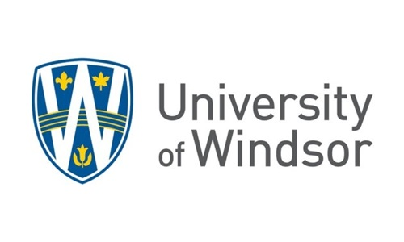

# Computer Engineering

### Master of Engineering · Academic Repository

**A comprehensive directory of academic coursework, projects, reference materials, and learning resources from a Master of Engineering program in Computer Engineering.**

---

[❖ Author](#author) &nbsp;·&nbsp; [ⓘ Overview](#overview) &nbsp;·&nbsp; [◎ Motivation](#motivation) &nbsp;·&nbsp; [☰ Curriculum](#course-catalog) &nbsp;·&nbsp; [★ Projects](#computer-engineering--applied-research-projects) &nbsp;·&nbsp; [☷ Usage Guidelines](#usage-guidelines) &nbsp;·&nbsp; [© License](#license) &nbsp;·&nbsp; [⌬ About](#about-this-repository) &nbsp;·&nbsp; [✦ Acknowledgments](#acknowledgments)

---

<!-- AUTHORS -->

  
  ## Author

|  [**Amey Thakur**](https://github.com/Amey-Thakur)   |
| :---: |

---

## Overview

This repository serves as a centralized index to all academic work completed during the Master of Engineering program in Computer Engineering at the [University of Windsor](https://www.uwindsor.ca). Each linked repository contains lecture notes, laboratory assignments, project implementations, reference materials, and supplementary resources for the respective course.

**Purpose**: To provide organized access to educational content spanning four semesters of graduate study, facilitating knowledge sharing and academic reference.

**Target Audience**: Students, educators, researchers, and professionals seeking reference materials in advanced computer science and engineering disciplines.

---

## Motivation

Education is not a destination but a continuous journey. This repository represents my commitment to that philosophy: a deliberate effort to preserve, organize, and revisit the advanced knowledge acquired during my graduate studies in Computer Engineering.

The creation of this archive stems from a fundamental belief: **true learning transcends the classroom and extends far beyond graduation**. As I navigate my professional career, I recognize that the advanced concepts, methodologies, and problem-solving frameworks developed during these formative years remain invaluable. However, knowledge, when not actively maintained, fades. This repository serves as my intellectual foundation: a structured collection I can return to for relearning, reference, and reflection.

**Why this repository exists:**

- **Knowledge Preservation**: To capture and maintain the depth of understanding developed across four semesters of rigorous graduate study
- **Continuous Learning**: To create a resource that supports lifelong learning, enabling me to revisit advanced principles as I encounter complex challenges
- **Academic Integrity**: To document my authentic academic journey - every concept studied, every project implemented, every problem solved
- **Open Contribution**: To share these materials with the broader community, believing that knowledge grows when freely exchanged

This is more than a collection of files or a digital archive. It is a testament to years of intellectual growth, a record of challenges overcome, and a foundation upon which future learning will be built. By making this work publicly available, I hope it serves not only my own continued education but also assists others on their learning journeys.

> [!NOTE]
> All materials in this repository were created, compiled, and organized by me throughout my graduate program (2023-2024) as part of my coursework, laboratory assignments, and project implementations.

---

## Course Catalog

The curriculum is organized chronologically by semester, progressing from foundational graduate engineering principles to advanced computing specializations.

> [!TIP]
> Each **Course Code** link navigates directly to a dedicated repository containing extensive lecture notes, assignment solutions, and reference materials for that specific subject.

### Graduate Program
**Department of Electrical and Computer Engineering**

#### Semester I

| Code | Course Title | Repository | Project |
|:----:|:-------------|:----------:|:-------:|
| GENG 8000 | Engineering Technical Communications | [Course](https://github.com/Amey-Thakur/ENGINEERING-TECHNICAL-COMMUNICATIONS) | [UN SDG Sustainable Engineering Solutions](https://github.com/Amey-Thakur/ENGINEERING-TECHNICAL-COMMUNICATIONS?tab=readme-ov-file#iv-the-major-team-project-suite--capstone-engineering-design) |
| GENG 8010 | Engineering Mathematics | [Course](https://github.com/Amey-Thakur/ENGINEERING-MATHEMATICS) | — |

#### Semester II

| Code | Course Title | Repository | Project |
|:----:|:-------------|:----------:|:-------:|
| GENG 8020 | Engineering Project Management | [Course](https://github.com/Amey-Thakur/ENGINEERING-PROJECT-MANAGEMENT) | [Strategic Project Management Case Studies](https://github.com/Amey-Thakur/ENGINEERING-PROJECT-MANAGEMENT?tab=readme-ov-file#assignments) |
| GENG 8030 | Computational Methods and Modeling | [Course](https://github.com/Amey-Thakur/COMPUTATIONAL-METHODS-AND-MODELING-FOR-ENGINEERING-APPLICATIONS) | [Adaptive Cruise Control](https://github.com/Amey-Thakur/ADAPTIVE-CRUISE-CONTROL) |

#### Semester III

| Code | Course Title | Repository | Project |
|:----:|:-------------|:----------:|:-------:|
| ELEC 8560 | Computer Networks | [Course](https://github.com/Amey-Thakur/COMPUTER-NETWORKS) | — |
| ELEC 8900 | Machine Learning | [Course](https://github.com/Amey-Thakur/MACHINE--LEARNING) | [Zero-Shot Video Generation](https://github.com/Amey-Thakur/ZERO-SHOT-VIDEO-GENERATION) |
| VIP-CSL | VIP - Community Service Learning | [Open](https://github.com/Amey-Thakur/VIP-CSL-FALL-2023) | [View Certificate](https://github.com/Amey-Thakur/VIP-CSL-FALL-2023/blob/main/Amey%20Mahendra%20Thakur%20F23%20VIP-CSL%20Certificate%20.pdf) |

#### Semester IV

| Code | Course Title | Repository | Project |
|:----:|:-------------|:----------:|:-------:|
| ELEC 8330 | Computational Intelligence | [Course](https://github.com/Amey-Thakur/COMPUTATIONAL-INTELLIGENCE) | [Computational Intelligence Algorithms](https://github.com/Amey-Thakur/COMPUTATIONAL-INTELLIGENCE?tab=readme-ov-file#matlab-programs) |
| ELEC 8900 | Digital Communications | [Course](https://github.com/Amey-Thakur/DIGITAL-COMMUNICATIONS) | [Simulink Digital Communication Models](https://github.com/Amey-Thakur/DIGITAL-COMMUNICATIONS?tab=readme-ov-file#simulink-projects) |

---

## Computer Engineering & Applied Research Projects

A curated collection of engineering projects developed throughout the program, demonstrating practical application of theoretical concepts across various domains of computer science and engineering.

  &nbsp; <b>Watch All Projects:</b> <a href="https://youtube.com/playlist?list=PLGOc13Pt03SZ9INe4gyxoZnA4zAXssiLn">Engineering Projects YouTube Playlist</a>

> [!IMPORTANT]
> **[Advancing Ideas @ AmeyArc_](https://amey-thakur.github.io/)** serves as a dedicated research space for technical notes and scholarly reflections. It documents the theoretical foundations and evolving ideas that accompany these practical engineering projects.

### Featured Projects

- [x] **[Zero-Shot Video Generation](https://github.com/Amey-Thakur/ZERO-SHOT-VIDEO-GENERATION)** · Machine Learning & Computer Vision (Semester III)
- [x] **[Adaptive Cruise Control](https://github.com/Amey-Thakur/ADAPTIVE-CRUISE-CONTROL)** · Computational Modeling & Control Systems (Semester II)

> [!NOTE]
> All projects listed in this repository are verified implementations. Detailed visual demonstrations, technical reports, and environment configuration guides are available throughout the archive.

### Coursework Implementations
*A systematic portfolio of **advanced technical implementations** and **applied system models** developed throughout the graduate curriculum.*

> [!TIP]
> **Applied Theory**: This section itemizes the specific technical implementations and system models developed throughout the program. Each entry represents a practical application of advanced theoretical concepts, ranging from algorithmic design in **MATLAB/Simulink** to strategic **project management** frameworks.

📡 **Simulink Digital Communication Models** · *Digital Communications (Semester IV)*
  - [x] [Binary Pulse Amplitude Modulation (BPAM)](https://github.com/Amey-Thakur/DIGITAL-COMMUNICATIONS/tree/main/Project/Task%202%20-%20Pulse%20Amplitude%20Modulation%20%28PAM%29)
  - [x] [M-ary Pulse Amplitude Modulation (MPAM)](https://github.com/Amey-Thakur/DIGITAL-COMMUNICATIONS/tree/main/Project/Task%202%20-%20Pulse%20Amplitude%20Modulation%20%28PAM%29)
  - [x] [Phase Shift Keying (PSK)](https://github.com/Amey-Thakur/DIGITAL-COMMUNICATIONS/tree/main/Project/Task%203%20-%20Phase%20Shift%20Keying%20%28PSK%29)
  - [x] [Quadrature Amplitude Modulation (QAM)](https://github.com/Amey-Thakur/DIGITAL-COMMUNICATIONS/tree/main/Project/Task%204%20-%20Quadrature%20Amplitude%20Modulation%20%28MQAM%29)
  - [x] [Offset QPSK (OQPSK)](https://github.com/Amey-Thakur/DIGITAL-COMMUNICATIONS/tree/main/Project/Task%205%20-%20Offset%20Quadrature%20Phase%20Shift%20Keying%20%28OQPSK%29)

🧠 **Computational Intelligence Algorithms** · *Computational Intelligence (Semester IV)*
  - [x] [Convolutional Neural Network](https://github.com/Amey-Thakur/COMPUTATIONAL-INTELLIGENCE/blob/main/MATLAB/Convolutional_Neural_Network.m)
  - [x] [Fuzzy Logic & Reasoning](https://github.com/Amey-Thakur/COMPUTATIONAL-INTELLIGENCE/blob/main/MATLAB/Fuzzy_Logic_and_Reasoning.m)
  - [x] [Genetic Algorithm Optimization](https://github.com/Amey-Thakur/COMPUTATIONAL-INTELLIGENCE/blob/main/MATLAB/Genetic_Algorithm_Optimization.m)
  - [x] [Self-Organizing Maps (SOM)](https://github.com/Amey-Thakur/COMPUTATIONAL-INTELLIGENCE/blob/main/MATLAB/Self_Organizing_Maps_Kohonen.m)
  - [x] [Radial Basis Function Network](https://github.com/Amey-Thakur/COMPUTATIONAL-INTELLIGENCE/blob/main/MATLAB/Radial_Basis_Function_Network.m)
  - [x] [Bidirectional Associative Memory](https://github.com/Amey-Thakur/COMPUTATIONAL-INTELLIGENCE/blob/main/MATLAB/Bidirectional_Associative_Memory.m)

📊 **Strategic Project Management Case Studies** · *Engineering Project Management (Semester II)*
  - [x] [PM Software Evaluation](https://github.com/Amey-Thakur/ENGINEERING-PROJECT-MANAGEMENT/blob/main/Assignments/EPM%20Assignment%201/A%20Comparative%20Evaluation%20of%20Project%20Management%20Software%20for%20Engineering%20Projects%20%5BAmey%20Thakur%20-%20110107589%5D.pdf)
  - [x] [Global Green Books Case Study](https://github.com/Amey-Thakur/ENGINEERING-PROJECT-MANAGEMENT/blob/main/Assignments/EPM%20Assignment%202/Driving%20Success%20through%20Project%20Management%20Implementation%20-%20A%20Case%20Study%20Analysis%20of%20Global%20Green%20Books%20Publishing.pdf)
  - [x] [E-KYC Platform Implementation](https://github.com/Amey-Thakur/ENGINEERING-PROJECT-MANAGEMENT/blob/main/Assignments/EPM%20Assignment%203/EPM%20Assignment%203%20-%20Case%20study%20and%20case%20study%20reviews.pdf)

🌍 **UN SDG Sustainable Engineering Solutions** · *Engineering Technical Communications (Semester I)*
  - [x] [Efficient Home Insulation](https://github.com/Amey-Thakur/ENGINEERING-TECHNICAL-COMMUNICATIONS?tab=readme-ov-file#iv-the-major-team-project-suite--capstone-engineering-design)

---

## Experiential Learning & Community Service
*A dedicated initiative bridging academic theory with meaningful community engagement.*

- [x] **[VIP - Community Service Learning](https://github.com/Amey-Thakur/VIP-CSL-FALL-2023)** · Data Analyst & Outreach Assistant (Semester III)

## Student Support Resources
*A systematic archive of **university support services** utilized throughout the graduate journey.*

- [x] **[International Student Centre](https://github.com/Amey-Thakur/INTERNATIONAL-STUDENT-CENTRE)** · Support for international students
- [x] **[Engineering International Student Advising](https://github.com/Amey-Thakur/ENGINEERING-INTERNATIONAL-STUDENT-ADVISING)** · Academic guidance
- [x] **[Writing Support](https://github.com/Amey-Thakur/WRITING-SUPPORT)** · Academic writing assistance

---

## Usage Guidelines

This repository is openly shared to support learning and knowledge exchange across the academic community.

**For Students**  
Use these repositories as reference materials for understanding concepts, reviewing implementations, and exploring project ideas. Each repository contains detailed documentation to facilitate self-paced learning.

**For Educators**  
These resources may serve as curriculum references, assignment examples, or supplementary teaching materials. Attribution is appreciated when utilizing content.

**For Researchers**  
The project implementations and documentation may provide insights into practical applications of computer science principles in educational contexts.

---

## License

This repository and all linked academic content are made available under the **Creative Commons Attribution 4.0 International License (CC BY 4.0)**. See the [LICENSE](LICENSE) file for complete terms.

> [!NOTE]
> **Summary**: You are free to share and adapt this content for any purpose, even commercially, as long as you provide appropriate attribution to the original author.

Copyright © 2023 - 2024 Amey Thakur

---

## About This Repository

**Created & Maintained by**: [Amey Thakur](https://github.com/Amey-Thakur)

This repository represents a comprehensive academic archive of my intellectual journey throughout the Master of Engineering program in Computer Engineering (2023-2024). It acts as a centralized index for advanced graduate-level research, laboratory implementations, and complex systems architecture. This digital legacy serves as both a formal reference for the academic community and a testament to the rigorous engineering standards maintained across four semesters of graduate study.

**Connect:** [GitHub](https://github.com/Amey-Thakur) &nbsp;·&nbsp; [LinkedIn](https://www.linkedin.com/in/amey-thakur) &nbsp;·&nbsp; [ORCID](https://orcid.org/0000-0001-5644-1575)

### Acknowledgments

**Institution**: [University of Windsor](https://www.uwindsor.ca), Windsor, Ontario, Canada  
**Faculty**: [Faculty of Engineering](https://www.uwindsor.ca/engineering/)  
**Department**: Electrical and Computer Engineering  
**Program**: Master of Engineering in Computer Engineering  
**Duration**: 2023 - 2024

Grateful acknowledgment to the **Faculty of Engineering** at the **University of Windsor** for their pedagogical leadership. Their contributions to my learning experience are deeply appreciated.

Grateful acknowledgment to **Jason Horn**, [**Writing Support**](https://github.com/Amey-Thakur/WRITING-SUPPORT), **University of Windsor**, for his distinguished mentorship and scholarly guidance. His thoughtful feedback and methodological precision were instrumental in strengthening the analytical depth and professional quality of my academic work. His commitment to excellence and integrity is gratefully acknowledged.

Grateful acknowledgment to the [**VIP - Community Service Learning (VIP-CSL)**](https://github.com/Amey-Thakur/VIP-CSL-FALL-2023) program and the **Arts Council - Windsor & Region (ACWR)** for providing a transformative experiential learning opportunity. I extend my sincere appreciation to **Dr. Rob Gordon**, **Jane Sylvester**, and **Maria Mediratta** for their leadership and unwavering support in bridging academic theory with meaningful community service.

Grateful acknowledgment to **Rob Janisse**, **Alumni Coordinator – Special Projects**, for organizing several impactful events during my time at university. I had the opportunity to work closely with him on multiple occasions, and he was always patient, supportive, and incredibly helpful. His guidance and mentorship made a meaningful difference in my university experience, and I truly appreciate the time, effort, and encouragement he consistently offered.

Special thanks to the **mentors** and **peers** whose encouragement, discussions, and support contributed meaningfully to this learning experience.

---

<!-- FOOTER -->

  [↑ Back to Top](#computer-engineering)

  [❖ Author](#author) &nbsp;·&nbsp; [ⓘ Overview](#overview) &nbsp;·&nbsp; [◎ Motivation](#motivation) &nbsp;·&nbsp; [☰ Curriculum](#course-catalog) &nbsp;·&nbsp; [★ Projects](#computer-engineering--applied-research-projects) &nbsp;·&nbsp; [☷ Usage Guidelines](#usage-guidelines) &nbsp;·&nbsp; [© License](#license) &nbsp;·&nbsp; [⌬ About](#about-this-repository) &nbsp;·&nbsp; [✦ Acknowledgments](#acknowledgments)

---

**🎓 Related Repository:** [Computer Engineering (Undergraduate)](https://github.com/Amey-Thakur/COMPUTER-ENGINEERING)

**Computer Engineering (B.E.) - University of Mumbai**

*The foundational archive of **baccalaureate studies** and **applied engineering labs**.*

---

### 🎓 [MEng Computer Engineering Repository](https://github.com/Amey-Thakur/MENG-COMPUTER-ENGINEERING)

**Computer Engineering (M.Eng) - University of Windsor**

*An archival record of **graduate-level research** and **advanced engineering coursework**.*

